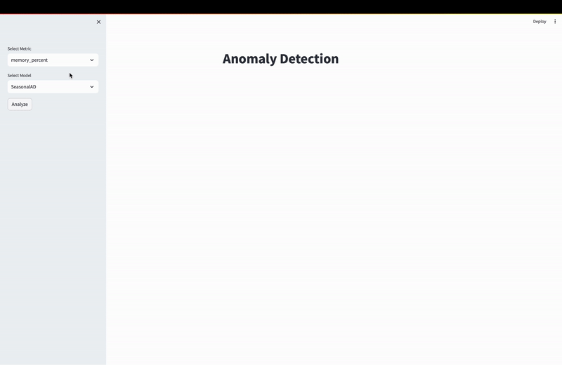

# Anomaly Detection
This project is an implementation of an anomaly detection system. The system is designed to detect anomalies in a stream of a server's resources' data using multiple methods.

The anomaly detection system implemented in this project does not rely on machine learning techniques. Instead, it utilizes complex statistical techniques to detect anomalies in a stream of server's resources' data. This approach allows the detector to generalize to any type of data and does not require training on specific data.

The techniques available for use in this project are:
- Seasonal decomposition of time series
- Generalized ESD test
- Quantile-based statistical process control charts

The data is streamed from an API and stored in a [time series Postgres database](https://www.timescale.com). The system then reads the data from the database and applies the statistical techniques to detect anomalies in the data.

## Preview
The following is a preview of the anomaly detection system in action. The system is detecting anomalies in the CPU utilization of a server.

## What is This?
This project is a proof of concept for a non-machine learning reliant anomaly detection system. The system is designed to detect anomalies in a stream of a server's resources' data using multiple methods.
